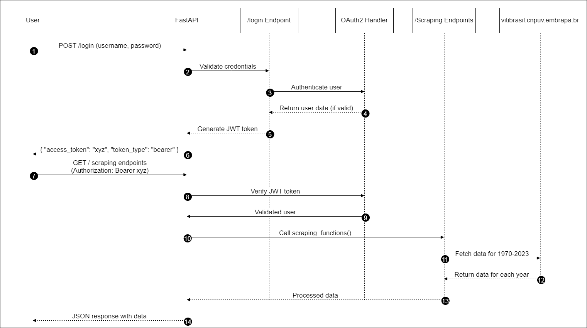

# FIAP Tech Chalenge 1 - Embrapa Web Scraping, API e Deployment

## 1. Visão Geral do Projeto
A **API de Dados da Embrapa** é uma API RESTful construída com FastAPI que permite aos usuários recuperar dados do site Vitibrasil da Embrapa. Ela oferece endpoints para acessar informações sobre a produção de uvas, processamento, comercialização, importação e exportação de 1970 a 2023. Essa API simplifica o processo de obtenção e análise de dados históricos, facilitando o acesso e a utilização dos dados para pesquisadores, empresas e entusiastas da viticultura.

## 2. Instruções de Instalação
Para configurar o projeto localmente, siga os passos abaixo:

### Pré-requisitos
- Python 3.9 ou superior
- FastAPI
- `pip` (gerenciador de pacotes do Python)

### Instalação
1. Clone o repositório:
   ```bash
   git clone https://github.com/adamsdossantos/tech_challenge_1
   cd app

2. Crie e ative um ambiente virtual:
   ```bash 
   python -m venv venv
   source venv/bin/activate  # No Windows use: venv\Scripts\activate

3. Instale as dependências necessárias:
   ```bash 
   pip install -r requirements.txt

4. Execute o servidor FastAPI
   ```bash
   uvicorn app.main:app --reload

5. Acesse a documentação do API em:
   http://127.0.0.1:8000/docs para o Swagger UI\\
   http://127.0.0.1:8000/redoc para o ReDoc

## 3. Guia de Uso

### Autenticação

- Obtenha um token JWT enviando uma requisição POST para /login/ com um nome de usuário e senha válidos:

   ```bash
   curl -X 'POST' \
   'http://127.0.0.1:8000/login/' \\
   -H 'accept: application/json' \\
   -H 'Content-Type: application/x-www-form-urlencoded' \\
   -d 'username=testuser&password=sua_senha'

- A resposta incluirá um token que você precisará usar nas requisições seguintes.

### Exemplos de Endpoints da API

- Obter dados de produção:
   ```bash
   curl -X 'GET' \\
   'http://127.0.0.1:8000/producao?limit=10&skip=0&search=vinho' \\
   -H 'Authorization: Bearer SEU_TOKEN_DE_ACESSO'

- Obter informações do usuário:
   ```bash
   curl -X 'GET' \\
   'http://127.0.0.1:8000/users/me' \\
   -H 'Authorization: Bearer SEU_TOKEN_DE_ACESSO'

- Obter dados de processamento:
   ```bashcurl -X 'GET' \\
   'http://127.0.0.1:8000/processamento?limit=10&skip=0&search=viniferas' \\
   -H 'Authorization: Bearer SEU_TOKEN_DE_ACESSO'

#### Endpoints Disponíveis

- /producao - Recupera dados de produção
- /processamento - Recupera dados de processamento
- /comercializacao - Recupera dados de comercialização
- /importacao - Recupera dados de importação
- /exportacao - Recupera dados de exportação
- /login - Autentica o usuário e fornece um token JWT
- /users/me - Recupera detalhes do usuário autenticado

## 4. Configuração

- As seguintes configurações podem ser ajustadas conforme necessário:
   - SECRET_KEY (em oauth2.py): Atualize este valor para uma geração de token mais segura.
   - ACCESS_TOKEN_EXPIRE_MINUTES (em oauth2.py): Altere a duração (em minutos) para definir quanto tempo o token JWT deve ser válido.
   - Banco de Dados: Modifique fake_users_db em oauth2.py para adicionar ou alterar usuários de teste.

## 5. Arquitetura



## 6. Diretrizes para Contribuição

- Contribuições são bem-vindas! Para contribuir:

   1. Faça um fork do repositório.

   2. Crie uma nova branch
      ```bash
      git checkout -b feature/nome-da-sua-feature

   3. Faça as suas alterações e commit:
      ```bash
      git commit -m "Adiciona nova funcionalidade"

   4. Envie as suas alterações para a branch:
      ```bash
      git push origin feature/nome-da-sua-feature

   5. Crie um pull request no GitHub

- Reportando Problemas
   Se encontrar algum bug ou tiver uma sugestão, por favor, abra uma issue [aqui](https://github.com/adamsdossantos/tech_challenge_1/issues).

- Padrões de Código
   Siga PEP 8 para o código Python.
   Certifique-se de que seu código passa por todos os testes antes de enviar um pull request.

## 7. Licença

- Este projeto é licenciado sob a Licença MIT - veja o arquivo LICENSE para mais detalhes.


